# DocHelper 文档生成器
## 快速入门

### 简介

**DocHelper** 开发的背景是因为项目需要写验收详设文档,但是开发过程中,很多时候在功能开发初期已经产出过类似的文档,但是验收文档总会有格式上的要求,所以书写对有格式要求的文档,更是一个是体力活,简直折磨有没有;

此外还有:

1. 作为格式要求高的项目,文档标题序号一定会有要求,但是word长文本编排,除了自身办公室文员,很少有人能处理很好的, 联想下当年的论文;当然段落少的,变化少的,你不会用标题编号功能,自然可以手写,效果没问题,但是副作用有三个:

   a. 无法生成标题目录

   b. 一旦中间的目录,需要改动,增加或者删除,对于编号的维护,那将是噩梦;有甚者,你可能要维护几百个标题编号,而最可怕的是,维护了之后,你仍然应对不了变化

   c. 无法应对频繁改动的文档

2. 手动写word标题编号,层级少,还可以,但是层级多的话,就很少能控制得当了,有的时候前面都好好的,新增一个标题,基本都会自动编号,但是往往层级之间的编号处理需要一定的技术,比如:6.2.1 下一个兄弟标题序号很简单,直接拷贝就得到,但是6.2.1.1需要你手动处理一番了,6.2.3.2.1亦是如此,往往牵一发而动全身

   word标题编号示例,如图:

   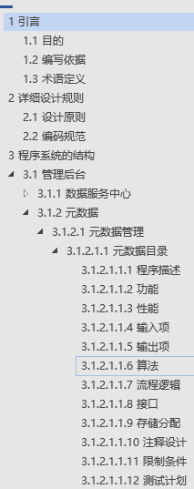

由于有之前处理word文档,和处理swagger的丰富经验,所以此项目就应运而生啦!   
***ps:妈妈再也不用担心我的文档啦!   :)***

> 愿景
>
> DocHelper不仅仅可以处理业务文档,可以处理任意文档的生成,因为它本身就是面向抽象文档设计的
>
> DocHelper希望把时间还给code,做**更多有意义的事情**,而不是为了枯燥的文档浪费时间 Give time back to yourself !

### TIPS
由于gitee防盗链机制,使用typora+自定义图床的图片无法在gitee上正常显示(PC端无法正常,手机端好像正常,若你能看到图片,可以忽略本提示),下载到本地即可,或者等我重新制图

### 使用须知

**BusinessDocHelper-1.0-SNAPSHOT** 已知bug:

- 生成的文档目录标题超过4级后,会有一个新的排序数字前缀(如图:)

  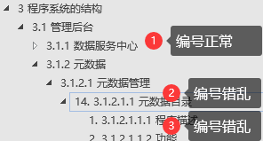

  

> 解决方案:手动修改word文档,对应的标题样式表,注意,只需要修改标题对应的标题样式,改一处,全文生效,所以不麻烦,跟你加粗一个字体一样简单 
>
> 操作步骤如下:

1. 第一步 找到错乱的标题

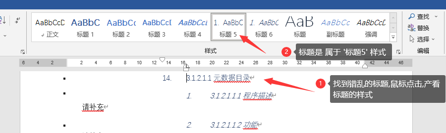

2. 第二步 在错误标题的样式,右击,选中修改

   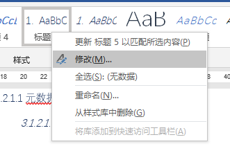

3. 第三步 打开样式配置

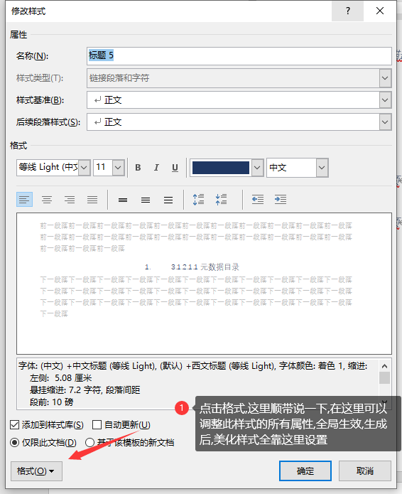

4. 选择编号设置


5. 设置无编号即可

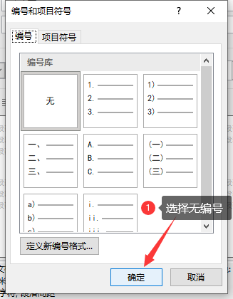

### 前置技能

我将通过一个实际的demo例子来阐述如何使用,在此之前,希望你有如下技能:

- 简单的处理word文档的技能,(您将会在做word文档处理的时候用到)
- 简单的处理excel文档的技能,(您将会在做文档配置的时候用到)

- 简单的java调试功底,(目前还没有以服务的形式发布出来,本地运行需要java环境)

Let's Start 😊

### 配置说明

您需要配置一张EXCEL表:结构如下

#### 1. 基础菜单配置

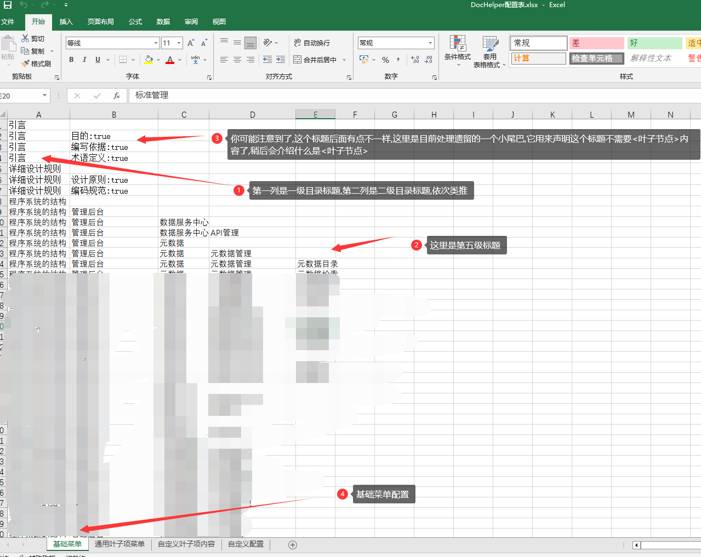

- 叶子节点,结构树的最下级节点称之为叶子节点 

> 可能有小伙伴疑问,那么第五级目录是不是叶子节点,一般来说 是它;但是DocHelper将标题树和最后一级内容拆开了,叶子节点单独维护,基础菜单树上只维护标题结构,具体的内容都在叶子节点上了,这样的设计类似于B+树的设计,还有个好处就是,可以大幅度减少整体的配置量,如果叶子节点在基础菜单中配置,则配置文档的总行数= 基础菜单项的行数* 叶子节点项的行数,是一个笛卡尔积

#### 2. 通用叶子项节点菜单配置

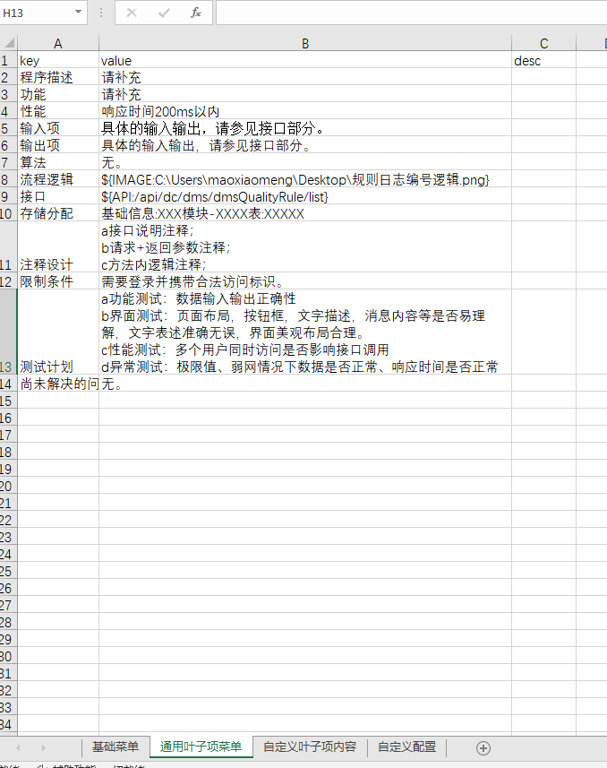

- 叶子节点的配置就是简单的key,value结构,desc是用来提示使用者的,生成过程中不会读取它;

> 细心的你一定发现了${IMAGE:xxxx},${API:xxxx}的写法,如果你是有一定开发经验的人,应该不难明白,这里是动态配置值内容
>
> 通用叶子项节点菜单的作用是为了给所有声明了有叶子节点的基础菜单,每一个菜单的最下级节点配置上一批额外的默认叶子项

它一共有如下几种写法:

- ${TEXT:你好啊DocHelper} 

   用于普通文本的插入,可以省略不写,直接写内容,支持Excel单元格内换行

- ${IMAGE:C:\Users\xxxxx\.png}  或 ${IMAGE:http://example.com/example.png} 

   用于图片的插入,它支持如上两种写法,一种是读取本地图片路径,一种是读取网络图片路径

- ${TABLE:[{"a":"a1","b":"b1"}]} 

   用于表格数据的插入,值需要是一段列表数据,暂时

- ${HTML:"&lt;p style="color:red">你好啊</&gt;"}

   用于HTML文本数据的渲染,值需要是一段正确的html片段

- ${API:/api/demo/getList}

   用于读取swagger指定的接口并渲染

#### 3. 自定义叶子节点项内容

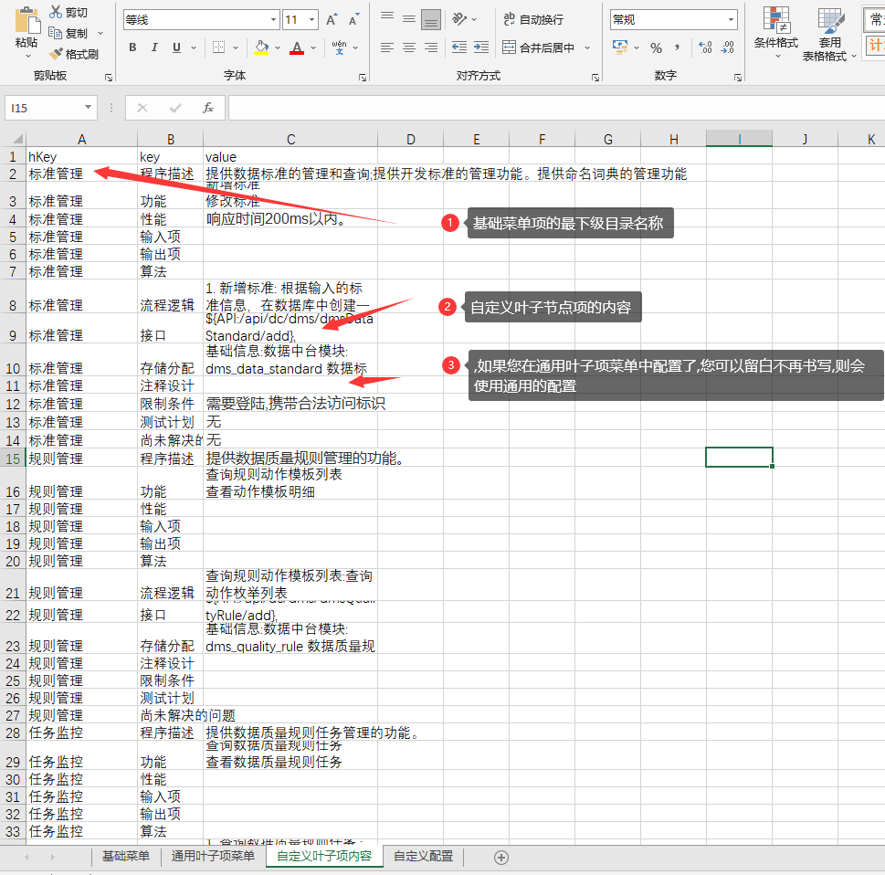

> 自定义叶子项内容的菜单是为了在通用的叶子上,进行具体功能项的重新指定

**hKey**:指代基础菜单中的最下级目录的名称,要对应

**key**: 对应的叶子项菜单的key

**value**: 自定义的值,书写方式和通用叶子项菜单的配置如出一辙

#### 4. 全局自定义配置

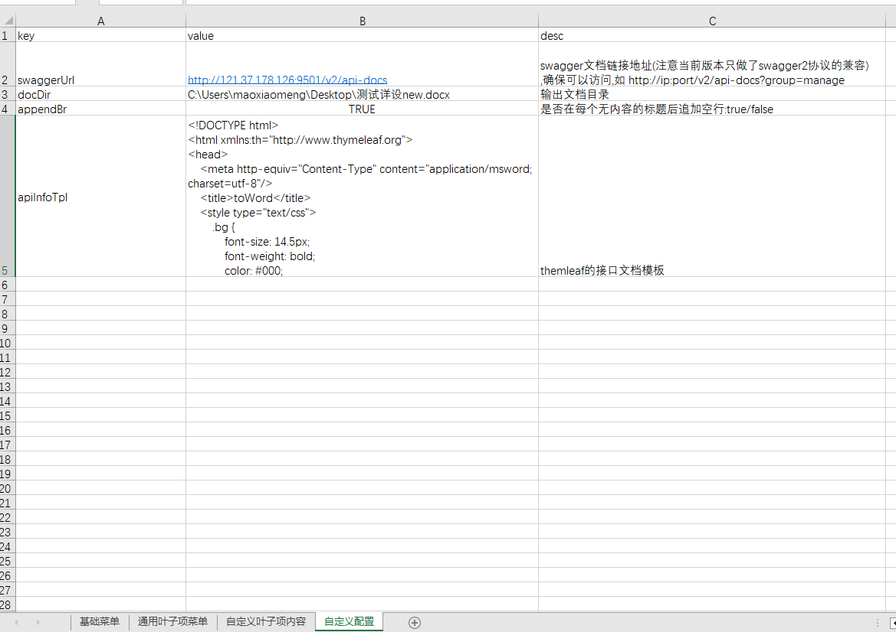

>自定义全局配置,(图中是自定义配置,不过没有关系,DocHelper是通过sheet索引来获取配置的,所以名称修改也没有关系,但是千万不要调整配置sheet顺序!)

- swaggerUrl:读取接口的时候需要,这里相对于文档层的抽象来说,这个属性应该是自定义属性,不属于通用属性,这个会在后续的维护中调整
- docDir:输出的文档目录
- appendBr: 是否在每一个无内容的标题后追加空行,便于后续手动维护内容的填充, true/false
- apiInfoTpl: 渲染api接口表格的html段落模板,如果项修改api样式,修改此模板即可,将内容与样式解耦

好了以上就是全部的配置了.


### 快速开始

#### 1.下载项目

使用git工具下载项目(暂未上传至maven中央仓库)

> 项目地址 :    https://gitee.com/gaozexi/doc-helper.git

#### 2. 找到DocHelper

````java
//任意可执行代码的地方(main方法,测试类),仅需一句代码即可完成文档的生成:
public class Demo{
 public static void main(String[] args){
   DocHelper.start(null);
 }
}
````


#### 1.测试结果:

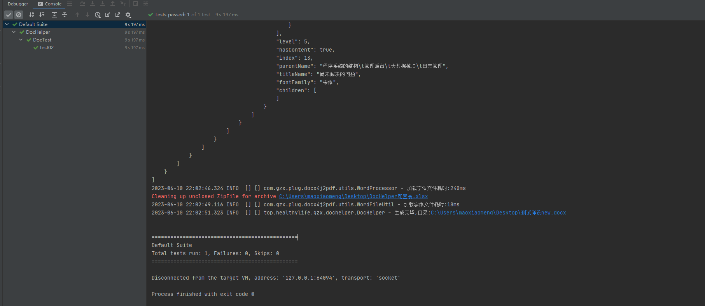

- 文档:美化前

  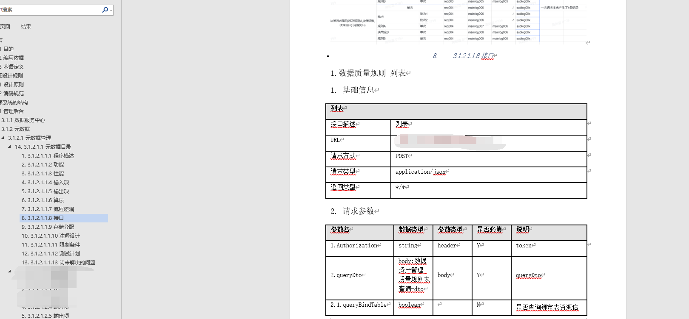

- 文档美化后(文档涉及权益,不便分享,仅截简图说明)

  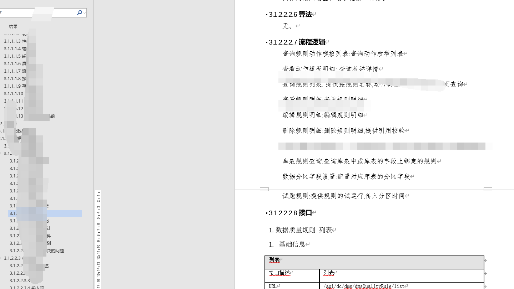

#### 后续功能维护

1. 基础菜单的叶子节点声明的配置位置移动

2. 支持${TABLE:$REF(5)}表格数据
3. 其他根据以后的业务需求,我自己用到一些功能没有的,会补齐

### 写在最后 

搞了几个晚上外带周末,白天还要写项目代码,改bug,晚上回家还得写,这几天着实有点累  :(  ,不过能节省大量的体力劳动,感觉还是有价值的 *★,°*:.☆(￣▽￣)/$:*.°★* 。

如果您觉得项目对您有所帮助,请帮忙给个⭐start⭐ ,也可以打赏下请作者喝杯奶茶


感兴趣的小伙伴欢迎一起加入改进 (作者微信:himaoxiaomeng 添加注明来意)

 